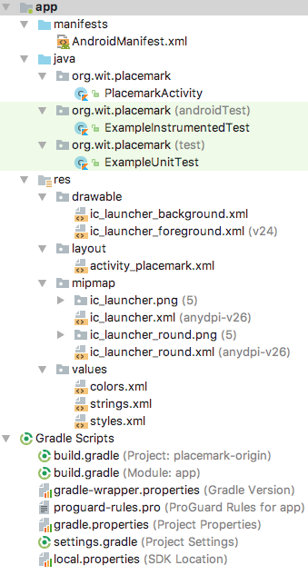

# Setup

Create an new Android project with the following key characteristics:

- Kotlin
- Single 'Blank' activity

Follow the structure and paramaters outlined here:

Your project should look like this:

Make sure you can build and run the project.

If you are using git, you might want to make the following small adjustments to the generated .gignore file:

~~~
*.iml
.gradle
/local.properties
/.idea
.DS_Store
/build
/captures
.externalNativeBuild
~~~

(we are excluding all .idea files)

Commit the project to a repository now.

Also, locate and review this perspective:

You will rarely need to inspect this view - but it is useful to consult occasionally as you proceed through these labs.