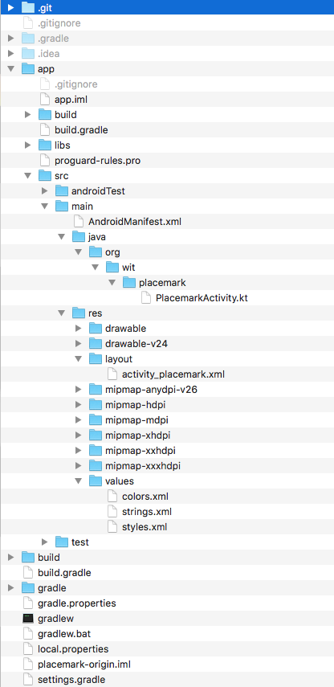

# Key Project Files & Resources

Although the project structure looks daunting, there are only a small number of source files to work with regularly:

Find each of these files now (there are presented here without filenames)

~~~
package org.wit.placemark

import android.support.v7.app.AppCompatActivity
import android.os.Bundle

class PlacemarkActivity : AppCompatActivity() {

  override fun onCreate(savedInstanceState: Bundle?) {
    super.onCreate(savedInstanceState)
    setContentView(R.layout.activity_placemark)
  }
}
~~~

---

~~~
<?xml version="1.0" encoding="utf-8"?>
<manifest xmlns:android="http://schemas.android.com/apk/res/android"
          package="org.wit.placemark">

  <application
      android:allowBackup="true"
      android:icon="@mipmap/ic_launcher"
      android:label="@string/app_name"
      android:roundIcon="@mipmap/ic_launcher_round"
      android:supportsRtl="true"
      android:theme="@style/AppTheme">
    <activity android:name=".PlacemarkActivity">
      <intent-filter>
        <action android:name="android.intent.action.MAIN"/>

        <category android:name="android.intent.category.LAUNCHER"/>
      </intent-filter>
    </activity>
  </application>

</manifest>
~~~
---
~~~
apply plugin: 'com.android.application'

apply plugin: 'kotlin-android'

apply plugin: 'kotlin-android-extensions'

android {
  compileSdkVersion 26
  defaultConfig {
    applicationId "org.wit.placemark"
    minSdkVersion 23
    targetSdkVersion 26
    versionCode 1
    versionName "1.0"
    testInstrumentationRunner "android.support.test.runner.AndroidJUnitRunner"
  }
  buildTypes {
    release {
      minifyEnabled false
      proguardFiles getDefaultProguardFile('proguard-android.txt'), 'proguard-rules.pro'
    }
  }
}

dependencies {
  implementation fileTree(dir: 'libs', include: ['*.jar'])
  implementation "org.jetbrains.kotlin:kotlin-stdlib-jre7:$kotlin_version"
  implementation 'com.android.support:appcompat-v7:26.1.0'
  implementation 'com.android.support.constraint:constraint-layout:1.0.2'
  testImplementation 'junit:junit:4.12'
  androidTestImplementation 'com.android.support.test:runner:1.0.1'
  androidTestImplementation 'com.android.support.test.espresso:espresso-core:3.0.1'
}
~~~
---
~~~
<?xml version="1.0" encoding="utf-8"?>
<android.support.constraint.ConstraintLayout
    xmlns:android="http://schemas.android.com/apk/res/android"
    xmlns:app="http://schemas.android.com/apk/res-auto"
    xmlns:tools="http://schemas.android.com/tools"
    android:layout_width="match_parent"
    android:layout_height="match_parent"
    tools:context="org.wit.placemark.PlacemarkActivity">

  <TextView
      android:layout_width="wrap_content"
      android:layout_height="wrap_content"
      android:text="Hello World!"
      app:layout_constraintBottom_toBottomOf="parent"
      app:layout_constraintLeft_toLeftOf="parent"
      app:layout_constraintRight_toRightOf="parent"
      app:layout_constraintTop_toTopOf="parent"/>

</android.support.constraint.ConstraintLayout>
~~~
---
~~~
<resources>
  <string name="app_name">Placemark</string>
</resources>
~~~
---
~~~
<resources>

  <!-- Base application theme. -->
  

</resources>
~~~
---

The files are (in order of appearence)

- app/src/main/java/org/wit/placemark/PlacemarkActivity.kt
- app/src/main/AndroidManifest.xml
- app/build.gradle
- app/src/main/res/layout/activity_placemark.xml
- app/src/main/res/values/strings.xml
- app/src/main/res/values/styles.xml

Locate all of these files in the Android Studio 'Android' perspective:

and in the 'Project' perspective:

and using Finder/Explorer:

As you gain experience in android - the role and purpose of each of these files will become clearer. 

