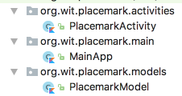

# MainApp

Create a new package called `org.wit.placemark.wit`, and introduce this class:

## MainApp

~~~
package org.wit.placemark.main

import android.app.Application
import org.jetbrains.anko.AnkoLogger
import org.jetbrains.anko.info

class MainApp : Application(), AnkoLogger {

  override fun onCreate() {
    super.onCreate()
    info("Placemark started")
  }
}
~~~

The package structure should look like this:

In addition, change the AndroidManifest to specifically reference this class:

## AndroidManifest.xml

~~~
...
  <application
      android:name="org.wit.placemark.main.MainApp"
...
~~~

A single instance of this class will be created when our application will be launched. A reference to this application can be acquired in other activities as needed.

Run the app now, and verify that the log message is being generated.

We can now put the placemarks in to this class:

## MainApp

~~~
class MainApp : Application(), AnkoLogger {

  val placemarks = ArrayList<PlacemarkModel>()

  override fun onCreate() {
    super.onCreate()
    info("Placemark started")
  }
}
~~~

... and we can adjust PlacemarkActivity to use this list instead of the one we had created in PlacemarkActivity:

~~~
class PlacemarkActivity : AppCompatActivity(), AnkoLogger {

  var placemark = PlacemarkModel()
  var app : MainApp? = null

  override fun onCreate(savedInstanceState: Bundle?) {
    super.onCreate(savedInstanceState)
    setContentView(R.layout.activity_placemark)
    app = application as MainApp

    btnAdd.setOnClickListener() {
      placemark.title = placemarkTitle.text.toString()
      placemark.description = description.text.toString()
      if (placemark.title.isNotEmpty()) {
        app!!.placemarks.add(placemark.copy())
        info("add Button Pressed: $placemarkTitle")
        app!!.placemarks.forEach { info("add Button Pressed: ${it}")}
      }
      else {
        toast ("Please Enter a title")
      }
    }
  }
}
~~~

##  Null Safety

Notice the the reference to the MainApp object:

~~~
  var app : MainApp? = null
~~~

How it is initialised:

~~~
    app = application as MainApp
~~~

and how it is used:

~~~
        app!!.placemarks.add(placemark.copy())
        info("add Button Pressed: $placemarkTitle")
        app!!.placemarks.forEach { info("add Button Pressed: ${it}")}
~~~

There is liberal use of `?` and `!!` in this code. This is an example of Null Safety in action in Kotlin. A key feature of Kotlin - (see point 2 a few pages down):

- <https://antonioleiva.com/kotlin-for-android-introduction/>

A more detailed outline here 

- <https://kotlinlang.org/docs/reference/null-safety.html>

## lateinit

Sometimes, we which to override null safety checks - particularly if we are certain that the reference will in fact me initialised. Replace MainApp now with this version:

## MainApp

~~~
class PlacemarkActivity : AppCompatActivity(), AnkoLogger {

  var placemark = PlacemarkModel()
  lateinit var app : MainApp

  override fun onCreate(savedInstanceState: Bundle?) {
    super.onCreate(savedInstanceState)
    setContentView(R.layout.activity_placemark)
    app = application as MainApp

    btnAdd.setOnClickListener() {
      placemark.title = placemarkTitle.text.toString()
      placemark.description = description.text.toString()
      if (placemark.title.isNotEmpty()) {
        app.placemarks.add(placemark.copy())
        info("add Button Pressed: $placemarkTitle")
        app.placemarks.forEach { info("add Button Pressed: ${it}")}
      }
      else {
        toast ("Please Enter a title")
      }
    }
  }
}
~~~

The changes an be seen in these lines:

~~~
  lateinit var app : MainApp
  ...
      app = application as MainApp
      ... 
        app.placemarks.add(placemark.copy())
        ...
        app.placemarks.forEach { info("add Button Pressed: ${it}")}
        ...
~~~

This is using the `lateint` qualifier. See this short discussion here:

- <https://medium.com/@mohitsharma_49363/android-kotlin-lazy-lateinit-and-delegates-9e5f01c561dc>

