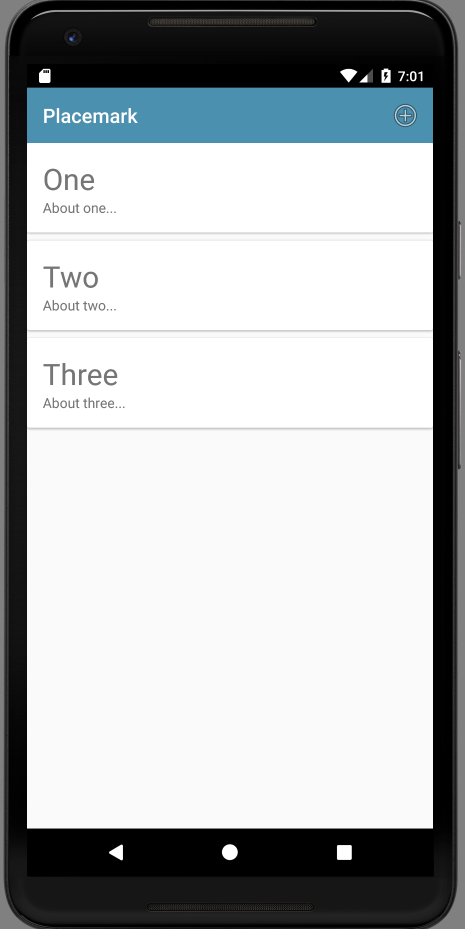

# Menu & Actionbar

In order to trigger the creation of Placemarks, we need some menu/action mechanic on our home screen. This will be provided by supporing a button/menu an action bar along the top of the PlacemarkListActivity.

First a new string resource:

## stings.xml

~~~
  <string name="menu_addPlacemark">Add</string>
~~~

Then a new menu resource:

## menu_main.xml

~~~
<?xml version="1.0" encoding="utf-8"?>
<menu xmlns:android="http://schemas.android.com/apk/res/android"
      xmlns:app="http://schemas.android.com/apk/res-auto">

  <item
      android:id="@+id/item_add"
      android:icon="@android:drawable/ic_menu_add"
      android:title="@string/menu_addPlacemark"
      app:showAsAction="always"/>
</menu>
~~~

The above resource must be in its own folder:

In the PlacemarkListActivity onCreate method, we must enable the action bar (and give it a title):

## PlacemarkListActivity

~~~
...
    toolbarMain.title = title
    setSupportActionBar(toolbarMain)
...
~~~

... and then override the method to load the menu resource:

~~~
...
  override fun onCreateOptionsMenu(menu: Menu?): Boolean {
    menuInflater.inflate(R.menu.menu_main, menu)
    return super.onCreateOptionsMenu(menu)
  }
...  
~~~

This gives us a single button on the action bar:

This is the stock icon we are using is 

~~~
      android:icon="@android:drawable/ic_menu_add"
~~~

This is drawn from this set:

- <http://androiddrawables.com/Menu.html>

These can change with each release of Android - a comprehensive set of all drawable resources is available here:

- <http://androiddrawables.com/>

