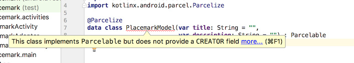

## Parcelable

We will switch on some additional Kotlin goodness - which will significantly simplify the next set of features.

## build.gradle

Before the dependencies:

~~~
androidExtensions {
  experimental = true
}
~~~

These experimental features are discussed here:

- <https://kotlinlang.org/docs/tutorials/android-plugin.html>

They are not without some issues - but quite usable.

This is a revised version of the PlacemarkModel class:

~~~
package org.wit.placemark.models

import android.os.Parcelable
import kotlinx.android.parcel.Parcelize

@Parcelize
data class PlacemarkModel(var title: String = "",
                          var description: String = "") : Parcelable
~~~

It implements a parcelize capability. This is discussed in detail here:

- <https://medium.com/@BladeCoder/reducing-parcelable-boilerplate-code-using-kotlin-741c3124a49a>

...but this was written without using the new feature we have just enabled, which dramatically reduces the boilerplate even further. Our approach is discussed here:

- <https://kotlinlang.org/docs/tutorials/android-plugin.html>

(towards the end)

Currently, the Studio may show an error:

Even when you resync gradle - a residue error may still be shown:

You CAN safely ignore this - as the facility will in fact work.

