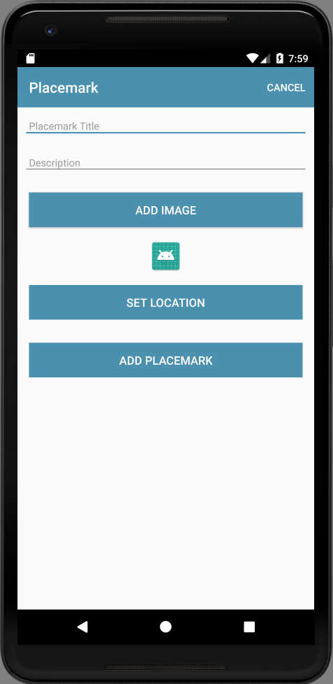

# Location Resources

First introduce a new button to set the location:

## strings.xml

~~~
  <string name="button_location">Set Location</string>
~~~

## activity_placemark.xml

~~~
        <Button
            android:id="@+id/placemarkLocation"
            android:layout_width="match_parent"
            android:layout_height="wrap_content"
            android:layout_margin="16dp"
            android:background="@color/colorAccent"
            android:paddingBottom="8dp"
            android:paddingTop="8dp"
            android:stateListAnimator="@null"
            android:text="@string/button_location"
            android:textColor="@color/colorPrimary"
            android:textSize="16sp"/>
~~~

## PlacemarkActivity

~~~
    placemarkLocation.setOnClickListener {
    }
~~~

Build & run the application now and make sure the button appears as expected

