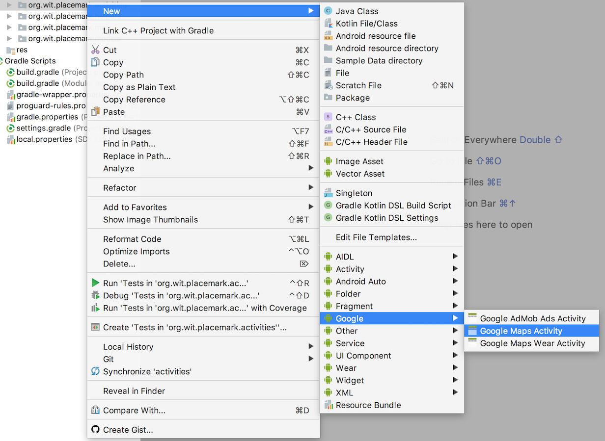
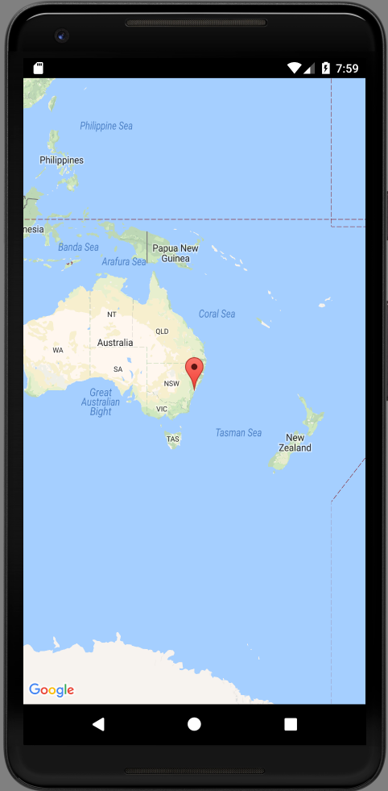

# Google Maps Activity

Briefly review then general guide to incorporating google maps here:

- <https://developer.android.com/training/maps/index.html>

In Studio, select the activities package, and from the context menu insert a new `Google Maps` activity:

## File Updates

This will generate updates to the following files:

## build.gradle:

~~~
  implementation 'com.google.android.gms:play-services-maps:11.6.2'
~~~

## strings.xml

~~~
  <string name="title_activity_maps">Map</string>
~~~

## AndroidManifest.xml

~~~
<?xml version="1.0" encoding="utf-8"?>
<manifest xmlns:android="http://schemas.android.com/apk/res/android"
          package="org.wit.placemark">

  <!--
         The ACCESS_COARSE/FINE_LOCATION permissions are not required to use
         Google Maps Android API v2, but you must specify either coarse or fine
         location permissions for the 'MyLocation' functionality. 
    -->
  <uses-permission android:name="android.permission.ACCESS_FINE_LOCATION"/>

  <application
      android:name=".main.MainApp"
      android:allowBackup="true"
      android:icon="@mipmap/ic_launcher"
      android:label="@string/app_name"
      android:roundIcon="@mipmap/ic_launcher_round"
      android:supportsRtl="true"
      android:theme="@style/AppTheme">
    <activity android:name=".activities.PlacemarkActivity">
    </activity>
    <activity android:name=".activities.PlacemarkListActivity">
      <intent-filter>
        <action android:name="android.intent.action.MAIN"/>

        <category android:name="android.intent.category.LAUNCHER"/>
      </intent-filter>
    </activity>
    <!--
             The API key for Google Maps-based APIs is defined as a string resource.
             (See the file "res/values/google_maps_api.xml").
             Note that the API key is linked to the encryption key used to sign the APK.
             You need a different API key for each encryption key, including the release key that is used to
             sign the APK for publishing.
             You can define the keys for the debug and release targets in src/debug/ and src/release/. 
        -->
    <meta-data
        android:name="com.google.android.geo.API_KEY"
        android:value="@string/google_maps_key"/>

    <activity
        android:name=".activities.MapsActivity"
        android:label="@string/title_activity_maps">
      <meta-data
          android:name="android.support.PARENT_ACTIVITY"
          android:value="org.wit.placemark.activities.PlacemarkActivity"/>
    </activity>
  </application>

</manifest>
~~~

## New Files

In Addition, these new files will have been generated:

## activity_maps.xml

~~~
<fragment xmlns:android="http://schemas.android.com/apk/res/android"
          xmlns:map="http://schemas.android.com/apk/res-auto"
          xmlns:tools="http://schemas.android.com/tools"
          android:id="@+id/map"
          android:name="com.google.android.gms.maps.SupportMapFragment"
          android:layout_width="match_parent"
          android:layout_height="match_parent"
          tools:context="org.wit.placemark.activities.MapsActivity"/>
~~~

## MapsActivity

~~~
package org.wit.placemark.activities

import android.support.v7.app.AppCompatActivity
import android.os.Bundle

import com.google.android.gms.maps.CameraUpdateFactory
import com.google.android.gms.maps.GoogleMap
import com.google.android.gms.maps.OnMapReadyCallback
import com.google.android.gms.maps.SupportMapFragment
import com.google.android.gms.maps.model.LatLng
import com.google.android.gms.maps.model.MarkerOptions
import org.wit.placemark.R

class MapsActivity : AppCompatActivity(), OnMapReadyCallback {

  private lateinit var mMap: GoogleMap

  override fun onCreate(savedInstanceState: Bundle?) {
    super.onCreate(savedInstanceState)
    setContentView(R.layout.activity_maps)
    // Obtain the SupportMapFragment and get notified when the map is ready to be used.
    val mapFragment = supportFragmentManager
        .findFragmentById(R.id.map) as SupportMapFragment
    mapFragment.getMapAsync(this)
  }

  /**
   * Manipulates the map once available.
   * This callback is triggered when the map is ready to be used.
   * This is where we can add markers or lines, add listeners or move the camera. In this case,
   * we just add a marker near Sydney, Australia.
   * If Google Play services is not installed on the device, the user will be prompted to install
   * it inside the SupportMapFragment. This method will only be triggered once the user has
   * installed Google Play services and returned to the app.
   */
  override fun onMapReady(googleMap: GoogleMap) {
    mMap = googleMap

    // Add a marker in Sydney and move the camera
    val sydney = LatLng(-34.0, 151.0)
    mMap.addMarker(MarkerOptions().position(sydney).title("Marker in Sydney"))
    mMap.moveCamera(CameraUpdateFactory.newLatLng(sydney))
  }
}
~~~

## google_maps_api.xml

~~~
<resources>
  <!--
    TODO: Before you run your application, you need a Google Maps API key.

    To get one, follow this link, follow the directions and press "Create" at the end:

    https://console.developers.google.com/flows/enableapi?apiid=maps_android_backend&keyType=CLIENT_SIDE_ANDROID&r=BC:AA:86:5A:D7:8C:52:EA:1C:F2:24:FB:80:2C:A6:73:1D:B4:DA:8B%3Borg.wit.placemark.activities

    You can also add your credentials to an existing key, using these values:

    Package name:
    BC:AA:86:5A:D7:8C:52:EA:1C:F2:24:FB:80:2C:A6:73:1D:B4:DA:8B

    SHA-1 certificate fingerprint:
    BC:AA:86:5A:D7:8C:52:EA:1C:F2:24:FB:80:2C:A6:73:1D:B4:DA:8B

    Alternatively, follow the directions here:
    https://developers.google.com/maps/documentation/android/start#get-key

    Once you have your key (it starts with "AIza"), replace the "google_maps_key"
    string in this file.
    -->
  <string name="google_maps_key" templateMergeStrategy="preserve" translatable="false">YOUR API KEY HERE</string>
</resources>
~~~

In the above file, you will need to insert your own API Key. 

Before proceeding, you will need to get a google map api key. Follow the guide here:

- <https://developers.google.com/maps/documentation/android-api/start#get-key>

and insert the key into the file above.

If all goes well, you should be able to start the maps activity:

## PlacemarkActivity

~~~
    placemarkLocation.setOnClickListener {
      startActivity (intentFor<MapsActivity>())
    }
~~~

If they key is correctly entered, the map should appear:

