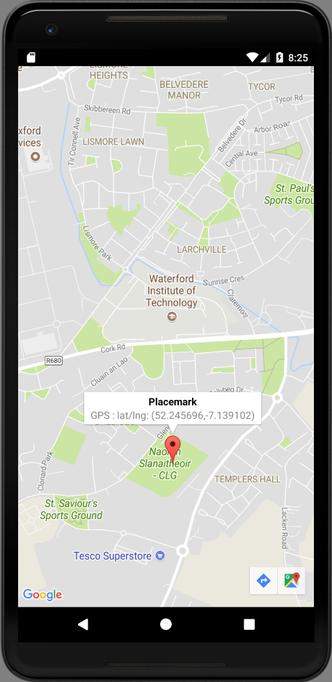

# Location Model

Introduce this new class alongside the PlacemarkModel class:

## PlacemarkModel

~~~
@Parcelize
data class Location(var lat: Double = 0.0,
                    var lng: Double = 0.0,
                    var zoom: Float = 0f) : Parcelable
~~~

We can now pass a location to the MapsActivity:

## PlacemarkActivity

~~~
    placemarkLocation.setOnClickListener {
      val location = Location(52.245696, -7.139102, 15f)
      startActivity (intentFor<MapsActivity>().putExtra("location", location))
    }
~~~

Here is a revised version of MapsActivity - which uses the Location model

## MapsActivity

~~~
package org.wit.placemark.activities

import android.support.v7.app.AppCompatActivity
import android.os.Bundle

import com.google.android.gms.maps.CameraUpdateFactory
import com.google.android.gms.maps.GoogleMap
import com.google.android.gms.maps.OnMapReadyCallback
import com.google.android.gms.maps.SupportMapFragment
import com.google.android.gms.maps.model.LatLng
import com.google.android.gms.maps.model.MarkerOptions
import org.wit.placemark.R
import org.wit.placemark.models.Location

class MapsActivity : AppCompatActivity(), OnMapReadyCallback {

  private lateinit var mMap: GoogleMap
  var location = Location()

  override fun onCreate(savedInstanceState: Bundle?) {
    super.onCreate(savedInstanceState)
    setContentView(R.layout.activity_maps)
    location = intent.extras.getParcelable<Location>("location")
    val mapFragment = supportFragmentManager
        .findFragmentById(R.id.map) as SupportMapFragment
    mapFragment.getMapAsync(this)
  }

  override fun onMapReady(googleMap: GoogleMap) {
    mMap = googleMap
    val loc = LatLng(location.lat, location.lng)
    mMap.addMarker(MarkerOptions().position(loc).title("Default Marker"))
    mMap.moveCamera(CameraUpdateFactory.newLatLngZoom(loc, location.zoom))
  }
}
~~~

Read this carefully, and note how the location object is being used. Specifically :

- it is being recovered from the intent in onCreate
- it is being used on onMapReady to center the map on the recovered location

Experiment with different hard coded lat/lng + zoom values and verify that the MapsActivity correctly renders. 

This is a slightly revised onMapReady implementation:

## MapsActivity

~~~
  override fun onMapReady(googleMap: GoogleMap) {
    mMap = googleMap
    val loc = LatLng(location.lat, location.lng)
    val options = MarkerOptions()
        .title("Placemark")
        .snippet("GPS : " + loc.toString())
        .draggable(true)
        .position(loc)
    mMap.addMarker(options)
    mMap.moveCamera(CameraUpdateFactory.newLatLngZoom(loc, location.zoom))
  }
~~~

Try it out now.

You should be able to select the marker - it will display its lat/lng. And also able to drag it to a different location.

Finally, to keep the code more consistent, rename the map from `mMap` to `map`:

## MapsActivity

~~~
class MapsActivity : AppCompatActivity(), OnMapReadyCallback {

  private lateinit var map: GoogleMap
  var location = Location()

  override fun onCreate(savedInstanceState: Bundle?) {
    super.onCreate(savedInstanceState)
    setContentView(R.layout.activity_maps)
    location = intent.extras.getParcelable<Location>("location")
    val mapFragment = supportFragmentManager
        .findFragmentById(R.id.map) as SupportMapFragment
    mapFragment.getMapAsync(this)
  }

  override fun onMapReady(googleMap: GoogleMap) {
    map = googleMap
    val loc = LatLng(location.lat, location.lng)
    val options = MarkerOptions()
        .title("Placemark")
        .snippet("GPS : " + loc.toString())
        .draggable(true)
        .position(loc)
    map.addMarker(options)
    map.moveCamera(CameraUpdateFactory.newLatLngZoom(loc, location.zoom))
  }
}
~~~

