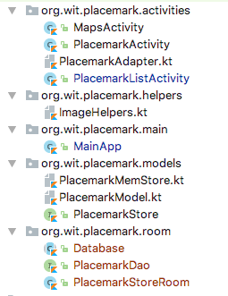

# Room Classes

## build.gradle

In 2017 Google introduced a vastly simplified approach to persisting objects to the SQLite database called Rooms:

- <https://developer.android.com/training/data-storage/room/index.html>

Review the introduction above (just the page linked) before proceeding.

First, we need to include the rooms libraries:

## build.gradle

New dependencies:

~~~
  compile 'android.arch.persistence.room:runtime:1.0.0'
  kapt 'android.arch.persistence.room:compiler:1.0.0'
~~~

Note the second dependency is slightly different - a `kapt` entry. Kapt is an annotation processor:

- <https://kotlinlang.org/docs/reference/kapt.html>

and we are using it here to engage the Room annotations we are about to use.

First, we adjust PlacemarkModel with additional annotations:

## Placemarkmodel

~~~
package org.wit.placemark.models

import android.arch.persistence.room.Entity
import android.arch.persistence.room.PrimaryKey
import android.os.Parcelable
import kotlinx.android.parcel.Parcelize

@Parcelize
@Entity
data class PlacemarkModel(@PrimaryKey(autoGenerate = true) var id: Long = 0,
                          var title: String = "",
                          var description: String = "",
                          var image: String = "",
                          var lat : Double = 0.0,
                          var lng: Double = 0.0,
                          var zoom: Float = 0f) : Parcelable

@Parcelize
data class Location(var lat: Double = 0.0,
                    var lng: Double = 0.0,
                    var zoom: Float = 0f) : Parcelable
~~~

We have included 2 additional annotations:

- [@Entity](https://developer.android.com/reference/android/arch/persistence/room/Entity.html)
- [@PrimaryKey](https://developer.android.com/reference/android/arch/persistence/room/PrimaryKey.html)

We now need some new classes - create a new package called `org.wit.placemark.room`

## Database

~~~
package org.wit.placemark.room

import android.arch.persistence.room.Database
import android.arch.persistence.room.RoomDatabase
import org.wit.placemark.models.PlacemarkModel

@Database(entities = arrayOf(PlacemarkModel::class), version = 1)
abstract class Database : RoomDatabase() {

  abstract fun placemarkDao(): PlacemarkDao
}
~~~

## PlacemarkDao

~~~
package org.wit.placemark.room

import android.arch.persistence.room.Dao
import android.arch.persistence.room.Insert
import android.arch.persistence.room.OnConflictStrategy
import android.arch.persistence.room.Query
import android.arch.persistence.room.Update
import org.wit.placemark.models.PlacemarkModel

@Dao
interface PlacemarkDao {

  @Insert(onConflict = OnConflictStrategy.REPLACE)
  fun create(placemark: PlacemarkModel)

  @Query("SELECT * FROM PlacemarkModel")
  fun findAll(): List<PlacemarkModel>

  @Update
  fun update(placemark: PlacemarkModel)
}
~~~

## PlacemarkStoreRoom

~~~
package org.wit.placemark.room

import android.arch.persistence.room.Room
import android.content.Context
import org.wit.placemark.models.PlacemarkModel
import org.wit.placemark.models.PlacemarkStore

class PlacemarkStoreRoom(val context: Context) : PlacemarkStore {

  var dao: PlacemarkDao

  init {
    val database = Room.databaseBuilder(context, Database::class.java, "room_sample.db")
        .fallbackToDestructiveMigration()
        .build()
    dao = database.placemarkDao()
  }

  override fun findAll(): List<PlacemarkModel> {
    return dao.findAll()
  }

  override fun create(placemark: PlacemarkModel) {
    dao.create(placemark)
  }

  override fun update(placemark: PlacemarkModel) {
    dao.update(placemark)
  }
}
~~~

