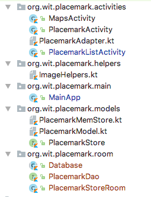

# RoomStore

Because we have based PlacemarkRoomStore on the PlacemarkStore interface, switching over to the database from the memory store should be reasonably straightforward

First, in MainApp, create a RoomStore instead of a MemStore:

## MainApp

~~~
package org.wit.placemark.main

import android.app.Application
import org.jetbrains.anko.AnkoLogger
import org.jetbrains.anko.info
import org.wit.placemark.models.PlacemarkMemStore
import org.wit.placemark.models.PlacemarkStore
import org.wit.placemark.room.PlacemarkStoreRoom

class MainApp : Application(), AnkoLogger {

  lateinit var placemarks: PlacemarkStore

  override fun onCreate() {
    super.onCreate()
   // placemarks = PlacemarkMemStore()
    placemarks = PlacemarkStoreRoom (applicationContext)
    info("Placemark started")
  }
}

Run the app now - it will fail to launch:

Look carefully at the Logcat - and see if you can identify the error:

~~~
Caused by: java.lang.IllegalStateException: Cannot access database on the main thread since it may potentially lock the UI for a long period of time.
~~~

Android will not permit access to the database on the main UI thread - as it can seriously degrade performance. In some circumstances, this requires low-level thread management code in your app:

- <https://developer.android.com/training/multiple-threads/index.html>

However, when working with Kotlin we have considerable convenience methods available via the anko libraries when attempting multi-threaded development in Android:

- <https://github.com/Kotlin/anko/wiki/Anko-Coroutines>
- <https://antonioleiva.com/anko-background-kotlin-android>

Before brining these features in your our application, we make one change to the way we have defined PlacemarkMemStore interface:

First, we mark the findAll() method as `suspend`:

## PlacemarkMemStore

~~~
  suspend fun findAll(): List<PlacemarkModel>
~~~

This is stating that the method may be suspended, in the context of a Kotlin Coroutine:

- <https://kotlinlang.org/docs/reference/coroutines.html>

If we make this change, we need to defined all implementations of the interface with the same signature:

## PlacemarkMemStore

~~~
  suspend override fun findAll(): List<PlacemarkModel> {
    return placemarks
  }
~~~

## PlacemarkStoreRoom

~~~ß
  suspend override fun findAll(): List<PlacemarkModel> {
    return dao.findAll()
  }
~~~

We can now move the findAll() call to a background thread:

## PlacemarkListActivity

~~~
  private fun loadPlacemarks() {
    async(UI) {
      showPlacemarks(app.placemarks.findAll())
    }
  }
~~~

Review this guide here for a basic introduction:

- <https://android.jlelse.eu/a-first-walk-into-kotlin-coroutines-on-android-fe4a6e25f46a>

We can launch the app now - however when we attempt to add a placemark, it will crash again.

